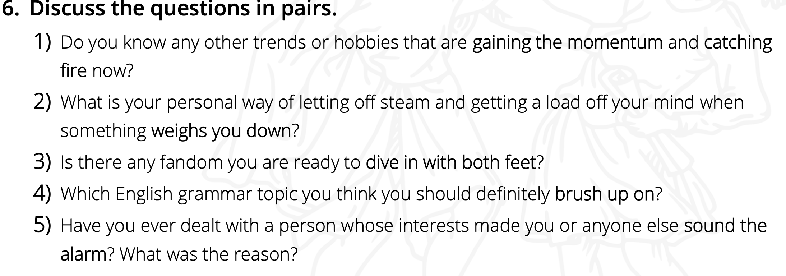
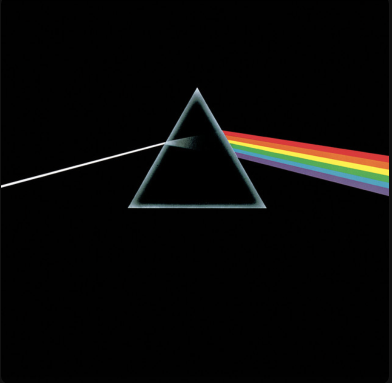

# English vocabulary and HW

## Table of Contents

- [Lesson №1 - 10.10.2024 (Egor)](#lesson-1)
- [Lesson №2 - 14.10.2024 (Maria)](#lesson-2)
- [Lesson №3 - 15.10.2024 (Egor)](#lesson-3)
- [HW - 16.10.2024 (Maria)](#hw)
- [Lesson №4 - 16.10.2024 (Maria)](#lesson-4)
- [Lesson №5 - 17.10.2024 (Egor)](#lesson-5)
- [Additional word study #1](#add-1)
## Lesson №1

- **Job seekers** – тот, кто ищет работу; 
- **Defensive** – оборонительный, защитный; 
- **Innocent** – Невиновный, наивен,  простодушный;	
- **CV** – резюме;	
- **The point of something** – суть чего-то (the point of the document);	
- **Exaggeration** – Гипербола, преувеличение;	
- **Good-natured rivalry** - добродушное соперничество (райвелри); 
- **light-hearted response** - легкомысленный ответ; 
- **foolproof answers** – безошибочные ответы;	
- **geek** – гик (типо задрот);	
- **decent** – достойный (decent chance);	
- **work-life balance** – баланс между работой и жизнью (типо в нынешние времена все мы ужасно заняты работой, при этом забываем о личной жизни, или наоборот);	
- **gut feeling** – интуиция, интуитивное чувство, чутье (интересно, что gut – это кишечник, то есть дословно это переводится так: кишечное чувство); 
- **amusing** – смешная, забавная; 
- **particular** – конкретный; 
- **intended** – предназначенный;

---

## Lesson №2

---

- **weigh them down** - make a person feel worried or unhappy because of problems they are facing;
  - отягощать их (морально);
- **in full swing** - currently happening or functioning at its peak or highest level of activity;
  - похоже на русское **полным ходом**;
- **go beyond the game** - become a serious or worrying issue;
  - ну типо выйти за какие-то рамки, став серьезной проблемой;
- **catching fire** - getting extreme popularity;
  - ну здесь все понятно, типо вот это ты, конечно, кэтчинг фаер;
- **brush up on** - refresh your memory or get a better understanding of an issue;
  - ну да, типо освежить память по поводу чего-то;
- **sound the alarm** - warn others about possible danger;
  - лучше всегод здесь подходит русское **Бить тревогу**;
- **dive in with both feet** - immerse yourself into an activity or process;
  - просто синоним погружения, но более гиперболизированное;
- **gain momentum** - to become stronger, more intense or popular;
  - опять же есть русский аналог **Набирать обороты**;

---

## HW for the second lesson!

---

---

1) **So, yeah**. At the last lesson we were talking about quadrobics, but I can add the other one - gambling. This is catching fire phenomena where every person should be rich at some point. Do you know, that gambling is healthy for you, because we have statistic that shows us count of dying: 1 million dying from smoking every year, 3 more million dying from alcohol abuse, but no one, no one have ever died from gambling. This is because gambling is healthy for you and this is a fundamental thing people need to live.

---

2) **Well, there** is only one option - GAMBLING! But we are so serious people and I have to answer you the same way. So, got to admit that I am not a both nervous and furious person and I've never been at the situation like in the answer, because I have a stable mind, but if we are going to imagine this situation, I would like to meet with my closest friends, discuss it with them, and after this crisis we will develop a company "Meme dogs" and we will dive in with both feet!

---

3) **No**, I'm not going to be part of any subculture, because I believe in Russia, in the Motherland, and no organization will sag me off.

---

4) **I guess** it would be helpful for me to brush up on both articles and mixed conditionals (actually, I don't know the real name of this theme);

---

5) Strange question, but we're here to practice our English, and I'm going to present the situation again. Yes, 7 years ago I had a friend Joe who was such an angry and anxious person. I didn't know what his problem was, but it was an outstanding trait of his mind and my gut feeling told me that I needed to stop communicating with him, and then I heard the following: A little boy from Grove Street killed everyone around him (mother, father, brother, etc.), even himself.... So where is the alarm sounding? I spoke to parents and teachers beforehand, but no one believed me, and it's so sad....

---

## Lesson №3

- `part-time` - неполный рабочий день\частичная занятость;
- `entrepreneur` - предприниматель;
- `reinvent` - изобрести заново (**reinvent yourself** - создавать себе новый имидж);
- `started-out` - начал, начинал (я начинал карьеру в Я);
- `retrained` - переподготовка, переквалификация, переобучить;
- `set up` - создать, учредить, установить, настроить;
- `switch` - переключать что-то, включать что-то, переключаться на что-то (switch on the next example, switch off the light);
- `advance` - развивать, продвигать, продвижение, наступление;

---

## Lesson №4

### 📄 Class work

- [Pdf worksheet](static/pdf-materials/prepositions_hard.pdf)
- [Useful link from teacher](https://www.youtube.com/watch?v=gifsHPX-loQ&list=LL&index=2&t=999s&ab_channel=LearnEnglishwithPapaTeachMe)

### 📚 Phrasal Verbs

- **Basics of Phrasal Verbs**: [Learn the fundamentals](https://stordar.ru/phrasal-verbs-basics/) of using phrasal verbs in English.
- **Article on Habr**: Explore a detailed study of [phrasal verbs](https://habr.com/ru/articles/495794/). There are 5 awesome articles about it (at the end you can find a link to the next article).
- **Phrasal Verb List**: Familiarize yourself with [176 phrasal verbs](https://poliglot16.ru/frazovye-glagoly/) for your studies.

### 📜 Prepositions

- A complete guide on [using prepositions](https://stordar.ru/how-to-use-english-prepositions-complete-guide/) in English.
- You can find additional resources on prepositions [here](https://lingvist.com/ru/kursy/izuchit-angliyskiy-online/resursy/predlogi-angliiskom-jazyke/).

### 🔍 Comparison of Prepositions

- Understand the differences between [amid, among, and between](https://www.englishclass101.com/lesson/english-grammar-made-easy-121-amid-vs-among-vs-between?lp=172) for more precise usage in your language.

---

## Lesson №5

- `agriculture` - сельское хозяйство, сельскохозяйственный;
- `construction` - строительство, конструкция;
- `social work` - социальная/общественная работа;
- `banking` - банковское дело/услуги/деятельность/сфера;
- `consultancy` - консалтинг, консультации, консультирование...;
- `medicine` - медицинский, лекарство(а);
- `journalism` - журналистика, публицистика;
- `research` - исследование, научные исследования;
- `publishing` - публикация, издание, издательство;
- `accountancy` - бухгалтерия (и всякая всячина, которая имеет тот же смысл);

## Additional word study #1

## 🤓 Interesting phrases

- `Not a clue` (I have no clue, I have no idea) - без понятия;
- `to amount to much`: 
  - I never expected that you to amount to much - в данном конексте - **достичь многого**;
  - Without improvements, your farms might not amount to much. - здесь же - не **составит много**;
- `to turn in` - I would never turn my homies in. - **сдавать в полицию**;
- `square one` - You got nothing. Square one. - У тебя нет ничего. **Полный ноль**;
- `you on your own` - ты **сам по себе**;
- `a dull` - The moments that make up a dull day - **скучный** (чтобы в запасе было что-то, кроме боринг);
- `to fritter` - You fritter and waste the hours in the offhand way. - **растрачивать** (интересно, что есть сущ. - оладья, пончик, пирожок);
- `to sink` - **утонуть** (как в прямом, так и переносном смысле), **исчезнуть**, **погрузиться** (смотрим на контекст двух предыдущих слов);
- `sinking` - And you run and you run to catch up with the sun, but it's sinking. - Интересно, что некоторые переводчики первели это по-разному: **но оно ускользало**, **но оно заходит**. Я думаю, что смысл понятен. Вот, что пишет словарь: **затопление**, **гибель**, **тонущий**, **тонет**, ...;
- `relative way` - The sun is the same in the relative way, but you're older. -**отностильный путь**, **относительно тоже**, **относительно такое же**;
- `come to naught` - Plans that either come to naught - **свеси на нет/к нулю**;
- `scriblle` - **каракуля, мазня, набросок, строчить, царапать, марать бумагу**; 
- **Hanging on in quiet desperation**:
  - `Hang on` - **держаться, зависнуть, цепляться, пребывать**;
  - `desperation` - **отчаяние, безысходность, безнадежность**;
  -  Most of all I intend to translate it like: **Пребывая в тихом отчаянии**;
- **The tolling of the iron bell**:
  - `tolling` - sound with a slow, regular rythm - звон колокола (также есть другие [определения](https://context.reverso.net/перевод/английский-русский/tolling))
  - **Meaning** - Эта фраза часто используется в литературе и поэзии для обозначения смерти, полного конца или перехода между этапами жизни. Звон колокола может напоминать о человеческой уязвимости и о том, что каждый из нас подвержен времени и своим судьбам.
- **Calls the faithful to their knees**:
  - `faithful` - верный, верующий, преданный, заслуживающий доверия;
  - **Meaning** - Фраза может использоваться в различных контекстах — от описания религиозной службы до поэтического или литературного образа, где акцентируется внимание на духовной природе человека, его стремлениях и внутреннем состоянии.

