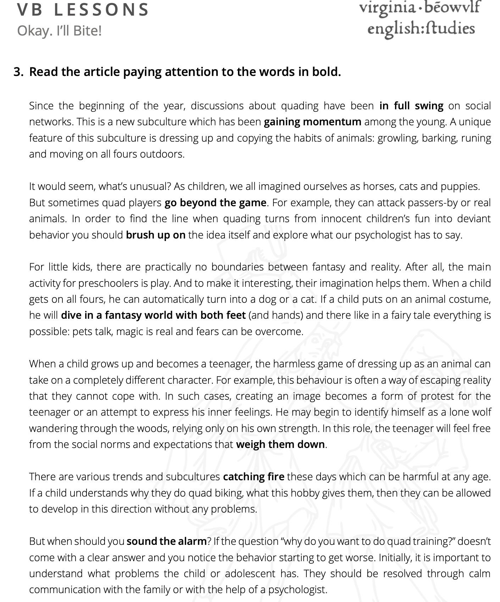
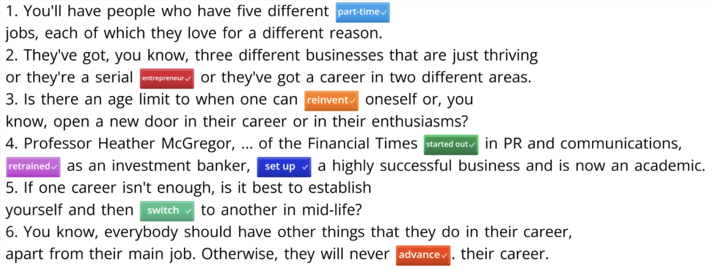
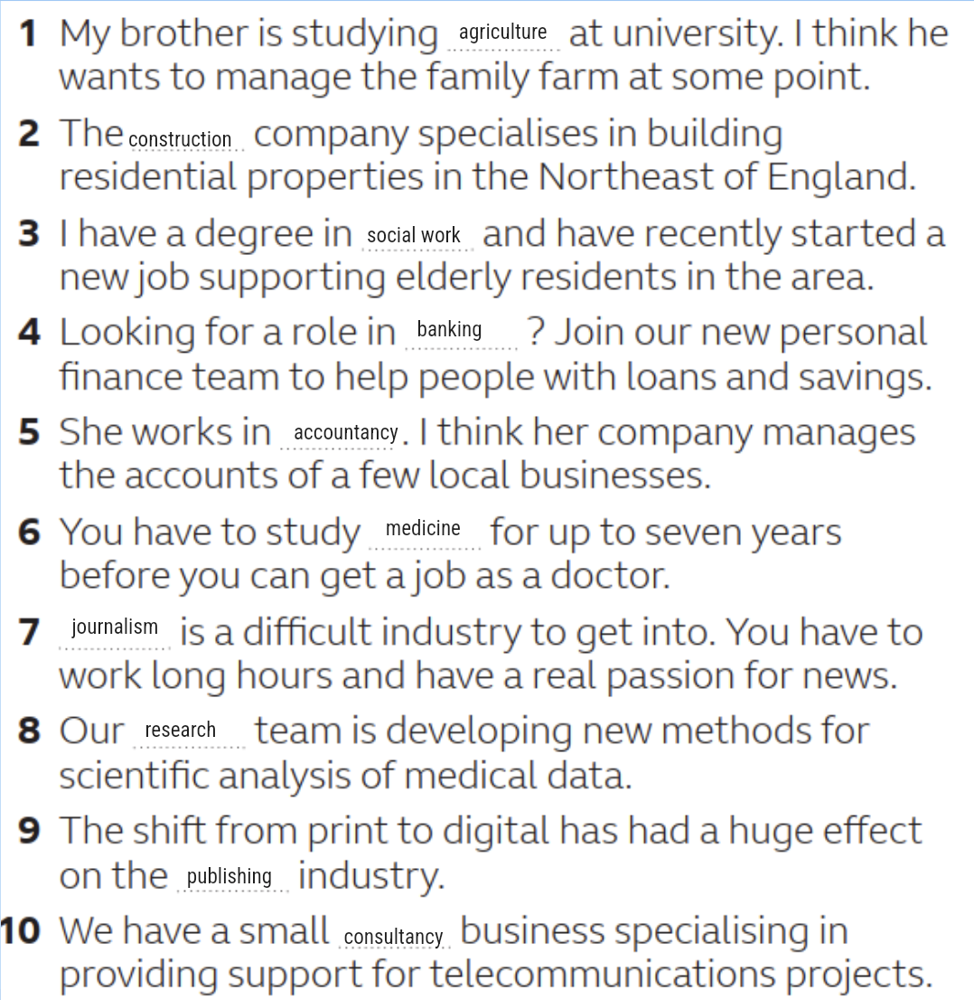
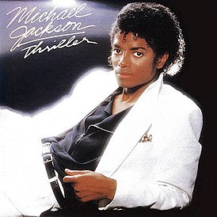

# English vocabulary and HW

## Reading

- [Harry Potter Part 1](static/pdf-materials/HarryPotterFIrstChapter.pdf) and [Notes](static/additionalReadme/HarryPotter1.md) [❌]

## Table of Contents

- [Home tasks](static/additionalReadme/HW.md)

- **October 2024**:

  - [Lesson №1 - 10.10.2024 (Egor)](#lesson-1)

  - [Lesson №2 - 14.10.2024 (Maria)](#lesson-2)

  - [Lesson №3 - 15.10.2024 (Egor)](#lesson-3)

  - [Lesson №4 - 16.10.2024 (Maria)](#lesson-4)

  - [Lesson №5 - 17.10.2024 (Egor)](#lesson-5)
  
  - [Lesson №6 - 21.10.2024 (Maria)](#lesson-6)

  - [Lesson №7 - 22.10.2024 (Egor)](#lesson-7)

  - [Lesson №8 - 23.10.2024 (Maria)](#lesson-8)

  - [Lesson №11 - 30.10.2024 (Maria)](#lesson-11)

- **November 2024**:

  - [Lesson №13 - 04.11.2024 (Maria)](#lesson-13)
  
  - [Lesson №14 - 15 - 06.11.2024 (Egor - Maria)](#lesson-15)

  - [Lesson №17 - 11.11.2024 (Maria)](#lesson-17)

  - [Lesson №18 - 12.11.2024 (Tanya)](#lesson-18)

  - [Lesson №21 - 18.11.2024 (Maria)](#lesson-21)

  - [Lesson №22 - 19.11.2024 (Egor)](#lesson-22)

  - [Lesson №23 - 20.11.2024 (Maria)](#lesson-23)

## Lesson №1

- **Job seekers** – тот, кто ищет работу; 

- **Defensive** – оборонительный, защитный; 

- **Innocent** – Невиновный, наивен,  простодушный;	

- **CV** – резюме;	

- **The point of something** – суть чего-то (the point of the document);	

- **Exaggeration** – Гипербола, преувеличение;	

- **Good-natured rivalry** - добродушное соперничество (райвелри); 

- **light-hearted response** - легкомысленный ответ; 

- **foolproof answers** – безошибочные ответы;	

- **geek** – гик (типо задрот);	

- **decent** – достойный (decent chance);	

- **work-life balance** – баланс между работой и жизнью (типо в нынешние времена все мы ужасно заняты работой, при этом забываем о личной жизни, или наоборот);

- **gut feeling** – интуиция, интуитивное чувство, чутье (интересно, что gut – это кишечник, то есть дословно это переводится так: кишечное чувство); 

- **amusing** – смешная, забавная; 

- **particular** – конкретный; 

- **intended** – предназначенный;

---

## Lesson №2

---

- **weigh them down** - make a person feel worried or unhappy because of problems they are facing;
  - отягощать их (морально);

- **in full swing** - currently happening or functioning at its peak or highest level of activity;
  - похоже на русское **полным ходом**;

- **go beyond the game** - become a serious or worrying issue;
  - ну типо выйти за какие-то рамки, став серьезной проблемой;

- **catching fire** - getting extreme popularity;
  - ну здесь все понятно, типо вот это ты, конечно, кэтчинг фаер;

- **brush up on** - refresh your memory or get a better understanding of an issue;
  - ну да, типо освежить память по поводу чего-то;

- **sound the alarm** - warn others about possible danger;
  - лучше всегод здесь подходит русское **Бить тревогу**;

- **dive in with both feet** - immerse yourself into an activity or process;
  - просто синоним погружения, но более гиперболизированное;

- **gain momentum** - to become stronger, more intense or popular;
  - опять же есть русский аналог **Набирать обороты**;

---

## Lesson №3

- `part-time` - неполный рабочий день\частичная занятость;

- `entrepreneur` - предприниматель;

- `reinvent` - изобрести заново (**reinvent yourself** - создавать себе новый имидж);

- `started-out` - начал, начинал (я начинал карьеру в Я);

- `retrained` - переподготовка, переквалификация, переобучить;

- `set up` - создать, учредить, установить, настроить;

- `switch` - переключать что-то, включать что-то, переключаться на что-то (switch on the next example, switch off the light);

- `advance` - развивать, продвигать, продвижение, наступление;

---

## Lesson №4

### 📄 Class work

- [Pdf worksheet](static/pdf-materials/prepositions_hard.pdf)
- [Useful link from teacher](https://www.youtube.com/watch?v=gifsHPX-loQ&list=LL&index=2&t=999s&ab_channel=LearnEnglishwithPapaTeachMe)

### 📚 Phrasal Verbs

- **Basics of Phrasal Verbs**: [Learn the fundamentals](https://stordar.ru/phrasal-verbs-basics/) of using phrasal verbs in English.
- **Article on Habr**: Explore a detailed study of [phrasal verbs](https://habr.com/ru/articles/495794/). There are 5 awesome articles about it (at the end you can find a link to the next article).
- **Phrasal Verb List**: Familiarize yourself with [176 phrasal verbs](https://poliglot16.ru/frazovye-glagoly/) for your studies.

### 📜 Prepositions

- A complete guide on [using prepositions](https://stordar.ru/how-to-use-english-prepositions-complete-guide/) in English.
- You can find additional resources on prepositions [here](https://lingvist.com/ru/kursy/izuchit-angliyskiy-online/resursy/predlogi-angliiskom-jazyke/).

### 🔍 Comparison of Prepositions

- Understand the differences between [amid, among, and between](https://www.englishclass101.com/lesson/english-grammar-made-easy-121-amid-vs-among-vs-between?lp=172) for more precise usage in your language.

---

## Lesson №5

- `agriculture` - сельское хозяйство, сельскохозяйственный;
- `construction` - строительство, конструкция;
- `social work` - социальная/общественная работа;
- `banking` - банковское дело/услуги/деятельность/сфера;
- `consultancy` - консалтинг, консультации, консультирование...;
- `medicine` - медицинский, лекарство(а);
- `journalism` - журналистика, публицистика;
- `research` - исследование, научные исследования;
- `publishing` - публикация, издание, издательство;
- `accountancy` - бухгалтерия (и всякая всячина, которая имеет тот же смысл);

---

## 📚 Lesson №6

### 🙉 New words

- **pet peeve** - **раздражение** [🔗](https://dictionary.cambridge.org/ru/словарь/английский/pet-peeve)

- **humiliation** - **унижение**, **хамское отношение** [🔗](https://context.reverso.net/перевод/английский-русский/humilitation)
  
- **facepalm** - She always does a `facepalm` when her mother starts asking her about boys. - **фейспалм** (рукалицо, лицоладонь) 
  
- **poke** - You'll `poke` someone in the eye with that umbrella if you are not careful! - **тыкать**, **совать**, **ткнуть**,  [🔗](https://context.reverso.net/%D0%BF%D0%B5%D1%80%D0%B5%D0%B2%D0%BE%D0%B4/%D0%B0%D0%BD%D0%B3%D0%BB%D0%B8%D0%B9%D1%81%D0%BA%D0%B8%D0%B9-%D1%80%D1%83%D1%81%D1%81%D0%BA%D0%B8%D0%B9/poke)
  
- **pat** - I want to `pat` a cat really badly; such a pity I can't have one in my flat. - **хлопок**, **погладить**, **гладить** [🔗](https://context.reverso.net/%D0%BF%D0%B5%D1%80%D0%B5%D0%B2%D0%BE%D0%B4/%D0%B0%D0%BD%D0%B3%D0%BB%D0%B8%D0%B9%D1%81%D0%BA%D0%B8%D0%B9-%D1%80%D1%83%D1%81%D1%81%D0%BA%D0%B8%D0%B9/pat)
  
- **slouch** - Don't `slouch` in your chair while working—it's bad for your back. - **сутулиться**, **сутулый**, **бездельник**, **дурак** [🔗](https://dictionary.cambridge.org/ru/%D1%81%D0%BB%D0%BE%D0%B2%D0%B0%D1%80%D1%8C/%D0%B0%D0%BD%D0%B3%D0%BB%D0%B8%D0%B9%D1%81%D0%BA%D0%B8%D0%B9/slouch)
  
- **slap** - In an instant, he `slapped` a couple of mosquitos on his arm. - **шлепать**, **хлопать**, **давать пощечину**, **шлепок**, **пощечина**  [🔗](https://dictionary.cambridge.org/ru/%D1%81%D0%BB%D0%BE%D0%B2%D0%B0%D1%80%D1%8C/%D0%B0%D0%BD%D0%B3%D0%BB%D0%B8%D0%B9%D1%81%D0%BA%D0%B8%D0%B9/slap)
  
- **cross arms** - I `crossed my arms`, pulled a face, and stared at the stranger. -  [🔗](https://dictionary.cambridge.org/ru/словарь/английский/cross-arms-fingers-legs)
  
- **fist bump** - After the game, we approached each other in order to `fist bump` and pay respect. - **ударить кулачками** [🔗](https://dictionary.cambridge.org/dictionary/english/fistbump)

- **thumbs up** - Just give me a `thumbs up` if you have no further questions. - **большой палец вверх** (символ одобрения) [🔗](https://context.reverso.net/перевод/английский-русский/thumbs-up)
  
- **point a finger** - She `pointed a finger` at the sky and asked if I noticed a few strangely shaped clouds. - **показывать на кого-то пальцем** (обвинять кого-то) [🔗](https://dictionary.cambridge.org/ru/словарь/английский/point-the-finger-at)

---

### 🌟 Idioms

- **pat on the back** - There there, boy, you've done everything you could and definitely deserve a `pat on the back`! - **похвала**, **поздравление** [🔗](https://dictionary.cambridge.org/dictionary/english-russian/a-pat-on-the-back)
  
- **slap on the wrist / to get off lightly** - Despite being caught cheating on his exams, the student received just a `slap on the wrist` with a warning not to do it again. - **мягкое наказание** [🔗](https://dictionary.cambridge.org/dictionary/english/slap-on-the-wrist)
  
- **point the finger** - She was quick to `point the finger` at her colleague Greg, accusing him of stealing documentation. - **возложить вину на кого-то**
  
- **slap in the face** - Your intelligence level is a `slap in the face` to the entire human race. - **оскорбление** [🔗](https://dictionary.cambridge.org/dictionary/english/slap-in-the-face)
  
- **give the finger** - I `gave` my ex-boyfriend the `finger` when he tried to apologize for cheating on me. - **показать кому-то средний палец** [🔗](https://dictionary.cambridge.org/dictionary/english/give-the-finger)
  
- **cross (someone) fingers** - I hope I will be able to buy some beer before the shops are closed, so `cross your fingers`! - **надеяться на лучшее**
  
- **poke the bear** - My grandma has finally stopped railing against tattoos and piercing, so don't `poke the bear` and get her going again! - **провоцировать кого-то** (не буди лихо, пока оно тихо) [🔗](https://dictionary.cambridge.org/ru/словарь/английский/poke-the-bear)

--- 

## 🎓 Lesson №7

- **treasure** - сокровище, вклад, достояние, дорожить, ценить, хранить [🔗](https://dictionary.cambridge.org/ru/словарь/англо-русский/treasure);

- **possesion** - the fact that you have or own something, something that you own or that you are carrying with you at a particular time [🔗](https://dictionary.cambridge.org/dictionary/english/possession);

- **to belong to something/someone** - быть частью организации/принадлежать кому-то [🔗](https://dictionary.cambridge.org/ru/словарь/английский/belong-to);

- **genuine** - искренний, настоящий, подлинный [🔗](https://dictionary.cambridge.org/ru/словарь/англо-русский/genuine);

- **borrow** - занимать, одалживать, брать заем [🔗](https://dictionary.cambridge.org/ru/словарь/англо-русский/borrow);

- **rubber** - резина (не только для стирания карандаша, но и резина для машин) [🔗](https://dictionary.cambridge.org/ru/словарь/англо-русский/rubber);

- **cotton** - хлопок [🔗](https://dictionary.cambridge.org/ru/словарь/англо-русский/cotton);

## 🌃 Lesson №8

### 📄 Class work

- [Pdf worksheet](static/pdf-materials/Prepos2.pdf)

### 📚 Words

- **to contradict** - (of people) to say the opposite of what someone else has said, or (of one fact or statement) to be so different from another fact or statement that one of them must be wrong: 

  - I am not scared of `contradicting` my friends or parents at all, sometimes you just should have strong opinions.  [🔗](https://dictionary.cambridge.org/ru/%D1%81%D0%BB%D0%BE%D0%B2%D0%B0%D1%80%D1%8C/%D0%B0%D0%BD%D0%B3%D0%BB%D0%B8%D0%B9%D1%81%D0%BA%D0%B8%D0%B9/contradict);

- **controversial** - causing disagreement or discussion:

  -  The book was very `controversial`. [🔗](https://dictionary.cambridge.org/ru/%D1%81%D0%BB%D0%BE%D0%B2%D0%B0%D1%80%D1%8C/%D0%B0%D0%BD%D0%B3%D0%BB%D0%B8%D0%B9%D1%81%D0%BA%D0%B8%D0%B9/controversial);

- **scarce** - not easy to find or get:

  - Food and clean water were becoming `scarce`. [🔗](https://dictionary.cambridge.org/ru/%D1%81%D0%BB%D0%BE%D0%B2%D0%B0%D1%80%D1%8C/%D0%B0%D0%BD%D0%B3%D0%BB%D0%B8%D0%B9%D1%81%D0%BA%D0%B8%D0%B9/scarce);

- **an arrogant** - unpleasantly proud and behaving as if you are more important than, or know more than, other people [🔗](https://dictionary.cambridge.org/ru/словарь/английский/arrogant);

## 🎃 Lesson №11

### 📄 Class work

- [Pdf worksheet](static/pdf-materials/VB_Halloween.pdf)

### 🌟 Idioms

- **the last/final nail in the coffin** - an event that causes the failure of something that had already started to fail [🔗](https://dictionary.cambridge.org/dictionary/english-russian/the-final-nail-in-the-coffin):

  1)  This latest evidence could be `the final nail in the coffin` for Jackson's case;

  2)  I am quite forgiving, but talking about me behind my back is just like putting `the last nail in the coffin`;

- **to lie like a tombstone** - To lie brazenly and barefacedly. Possibly from the fact that tombstone epitaphs favor positive descriptions of the deceased over factual characterizations [🔗](https://www.deepl.com/ru/translator#en/ru/To%20lie%20brazenly%20and%20barefacedly.%20Possibly%20from%20the%20fact%20that%20tombstone%20epitaphs%20favor%20positive%20descriptions%20of%20the%20deceased%20over%20factual%20characterizations.):
  
  1)  If I really wanted to get a job, I'd be okay with `lying like a tombstone` on my resume;

  2)  My brother always `lies like a tombstone` to get out of trouble with our parents. I just can't understand how they still believe him at this stage;

- **be like taking candy from a baby** - to be very easy [🔗](https://dictionary.cambridge.org/dictionary/english/be-like-taking-candy-from-a-baby):

  1) Beating them was the easiest thing in the world - it `was like taking candy from a baby`;

  2) Making me angry `is like taking candy from a baby`. I lose my temper very quickly;

- **devil-may-care** - not considering or worrying about the results of your actions [🔗](https://dictionary.cambridge.org/dictionary/english/devil-may-care);

- **to haunt** - If an unpleasant memory or feeling haunts you, you think about or feel it often **OR** If a ghost haunts a place, it appears there often;

- **a haunt** - a place that someone visits often [🔗](https://dictionary.cambridge.org/ru/%D1%81%D0%BB%D0%BE%D0%B2%D0%B0%D1%80%D1%8C/%D0%B0%D0%BD%D0%B3%D0%BB%D0%BE-%D1%80%D1%83%D1%81%D1%81%D0%BA%D0%B8%D0%B9/haunt);

- **to give up the ghost** - If someone gives up the ghost, they stop trying to do something because they no longer believe they can do it successfully. If a machine gives up the ghost, it stops working [🔗](https://www.collinsdictionary.com/dictionary/english/to-give-up-the-ghost#:~:text=Definition%20of%20'to%20give%20up%20the%20ghost'&text=If%20someone%20gives%20up%20the,they%20can%20do%20it%20successfully.);

- **get it into/through one's thick skull** - to realize or understand [🔗](https://www.merriam-webster.com/dictionary/get%20it%20into%2Fthrough%20one%27s%20thick%20skull);

- **can't hold a candle to** - to not be as good as the person or thing mentioned [🔗](https://dictionary.cambridge.org/dictionary/english/can-t-hold-a-candle-to);

### 📚 Words

- **breadwinner** - the member of a family who earns the money that the family needs [🔗](https://dictionary.cambridge.org/dictionary/english/breadwinner);

- **nun** - a member of a female religious group that lives in a convent (монастырь) [🔗](https://dictionary.cambridge.org/dictionary/english/nun);

## 😳 Lesson №13

### 📄 Class work

- [Pdf worksheet](static/pdf-materials/IntroExtraVert.pdf)

### 💬 Words and their explanations

- **downtime** - time spent relaxing or not working (**informal**) `OR` the time during which a machine, especially a computer, is not working or is not able to be used [🔗](https://dictionary.cambridge.org/ru/словарь/английский/downtime);

- **to thrive**  - to grow, develop, or be successful;

- **to be into something** - to like and be interested in something;

- **to see things through** - to remain with until the end or completion [🔗](https://www.collinsdictionary.com/dictionary/english-thesaurus/see-something-through);

- **purposeful** - showing that you know what you want to do;

- **sap**:
  
  - `verb` - If something saps your strength or confidence, it gradually weakens or destroys it;

  - `noun` - Sap is the watery liquid in plants and trees [🔗](https://www.collinsdictionary.com/dictionary/english/sap);

- **to curb** - to limit or control something;

- **to keep on top of something** - to stay organized and manage sth effectively;

- **to opt for** - select, choose, pick ...;

---

## 💩 Lesson №15

### 👃 Class work

- [Work sheet](static/pdf-materials/selectively%20social%20pt2.pdf)

- [Quiz](static/pdf-materials/reading%20downtime.pdf) (task 3)

### 💬 Words and their explanations

- **a fine** - an amount of money that has to be paid as a punishment for not obeying a rule or law [🔗](https://dictionary.cambridge.org/ru/словарь/английский/fine);

- **to violate** - to break or act against something, especially a law, agreement, principle, or something that should be treated with respect **OR** to go, especially forcefully, into a place or situation which should be treated with respect and in which you are not wanted or not expected to be [🔗](https://dictionary.cambridge.org/ru/словарь/английский/violate);

- **a deficiency** - the state of not having, or not having enough, of something that is needed [🔗](https://dictionary.cambridge.org/ru/словарь/английский/deficiency);

- **jerky** - meat that has been cut into long, thin strips and dried [🔗](https://dictionary.cambridge.org/ru/словарь/английский/jerky);

- **to mess (something) up** - to spoil or damage something, or to do something wrong or badly [🔗](https://dictionary.cambridge.org/ru/словарь/английский/mess-up);

- **shallow** - not showing serious or careful thought [🔗](https://dictionary.cambridge.org/ru/словарь/английский/shallow);

- **fleeting** - short or quick;

- **to embrace** - to accept something enthusiastically [🔗](https://dictionary.cambridge.org/ru/словарь/английский/embrace);

- **to snooze** - to sleep lightly for a short time, especially somewhere other than in your bed [🔗](https://dictionary.cambridge.org/dictionary/english/snooze);

- **a fiend** - someone who likes something very much or is very interested in something [🔗](https://dictionary.cambridge.org/dictionary/english/fiend);

- **solitary** - A solitary person or thing is the only person or thing in a place [🔗](https://dictionary.cambridge.org/dictionary/english/solitary);

- **spreadsheet** - an electronic document in which information is arranged in rows and columns, and can be used to do financial calculations and plans [🔗](https://dictionary.cambridge.org/dictionary/english/spreadsheet);

- **to deflate** - If something that has air or gas inside it deflates, or is deflated, it becomes smaller because it loses the air or gas [🔗](https://dictionary.cambridge.org/ru/словарь/английский/deflate);

- **slacker** - a person who does not work hard enough;

- **record** - a flat plastic disc on which music is recorded [🔗](https://dictionary.cambridge.org/ru/словарь/английский/record);

- **sourdough** - a mixture of flour and water that is left to ferment (= change in a chemical process) and then used to make bread:
  - `sourdough bread`;

- **vortex** - a mass of air or water that spins around very fast and pulls objects into its empty centre [🔗](https://dictionary.cambridge.org/ru/словарь/английский/vortex);

---

## Lesson №17

- **flaky** - behaving in a way that is strange, not responsible or not expected [🔗](https://dictionary.cambridge.org/ru/%D1%81%D0%BB%D0%BE%D0%B2%D0%B0%D1%80%D1%8C/%D0%B0%D0%BD%D0%B3%D0%BB%D0%B8%D0%B9%D1%81%D0%BA%D0%B8%D0%B9/flaky);

- **sincere** - (of a person, feelings, or behaviour) not pretending or lying; honest [🔗](https://dictionary.cambridge.org/ru/%D1%81%D0%BB%D0%BE%D0%B2%D0%B0%D1%80%D1%8C/%D0%B0%D0%BD%D0%B3%D0%BB%D0%B8%D0%B9%D1%81%D0%BA%D0%B8%D0%B9/sincere);

- **hypocrite** - someone who says they have particular moral beliefs but behaves in way that shows these are not sincere [🔗](https://dictionary.cambridge.org/ru/%D1%81%D0%BB%D0%BE%D0%B2%D0%B0%D1%80%D1%8C/%D0%B0%D0%BD%D0%B3%D0%BB%D0%B8%D0%B9%D1%81%D0%BA%D0%B8%D0%B9/hypocrite?q=hypocrites);

- **go ballistic** - to become extremely angry;

---

## Lesson №18

- **Herculean** - needing great strength and determination [🔗](https://dictionary.cambridge.org/ru/%D1%81%D0%BB%D0%BE%D0%B2%D0%B0%D1%80%D1%8C/%D0%B0%D0%BD%D0%B3%D0%BB%D0%B8%D0%B9%D1%81%D0%BA%D0%B8%D0%B9/herculean);

- **the Midas touch** - If someone has the Midas touch, that person is financially successful in everything they do [🔗](https://dictionary.cambridge.org/ru/%D1%81%D0%BB%D0%BE%D0%B2%D0%B0%D1%80%D1%8C/%D0%B0%D0%BD%D0%B3%D0%BB%D0%B8%D0%B9%D1%81%D0%BA%D0%B8%D0%B9/midas?q=midas+touch);

- **Gordian knot** - a difficult problem or situation [🔗](https://dictionary.cambridge.org/ru/%D1%81%D0%BB%D0%BE%D0%B2%D0%B0%D1%80%D1%8C/%D0%B0%D0%BD%D0%B3%D0%BB%D0%B8%D0%B9%D1%81%D0%BA%D0%B8%D0%B9/gordian-knot);

- **Achilles heel** - a small problem or weakness in a person or system that can result in failure [🔗](https://dictionary.cambridge.org/ru/%D1%81%D0%BB%D0%BE%D0%B2%D0%B0%D1%80%D1%8C/%D0%B0%D0%BD%D0%B3%D0%BB%D0%B8%D0%B9%D1%81%D0%BA%D0%B8%D0%B9/achilles-heel?q=Achilles+heel);

- **Augean Stables** - a place or situation where there is a lot of bad or dishonest behaviour that will be difficult to get rid of:

  - A campaigning US attorney decided that Wall Street was an `Augean Stables` that he was destined to muck out [🔗](https://dictionary.cambridge.org/ru/%D1%81%D0%BB%D0%BE%D0%B2%D0%B0%D1%80%D1%8C/%D0%B0%D0%BD%D0%B3%D0%BB%D0%B8%D0%B9%D1%81%D0%BA%D0%B8%D0%B9/augean-stables);

## Lesson №21

### 📄 Class work

- [Pdf worksheet](static/pdf-materials/VB%20Lessons%20—%20Body%20Language.pdf)

### 🌟 Idioms

- I’m all ears = I’m listening very carefully

  - Correct. This idiom means that someone is fully attentive and ready to listen.

- She gave me a cold shoulder = She helped me a lot

  - Incorrect. The correct definition is that “she ignored me” or “she was unfriendly to me.”

- It makes my blood boil = I really enjoy it

  - Incorrect. The correct definition is “it makes me very angry.”

- Keep an eye on this = Look after this

  - Correct. This idiom means to monitor or watch something carefully.

- Off the top of my head = This is the first thing that comes to my mind

  - Correct. It indicates giving an answer without much thought or preparation.

- It costs an arm and a leg = It’s reasonably priced
  
  - Incorrect. The correct definition is “it is very expensive.”

- We don’t see eye to eye on this = We don’t agree on this
  
  - Correct. This idiom means that two people do not have the same opinion.

- I got cold feet = I was freezing because of the weather

  - Incorrect. The correct definition is “I became nervous or scared about something.”

- I have a gut feeling = My stomach is upset

  - Incorrect. The correct definition is “I have an instinctive feeling about something.”

- He gave me a pat on the back = He praised me for doing a great job

  - Correct. This idiom means that someone acknowledged or congratulated you for your efforts.

- It sends shivers down my spine = It makes my back hurt

  - Incorrect. The correct definition is “it gives me a feeling of fear or excitement.”

- I had to get my hands dirty = I had to do something unpleasant / not honorable

  - Correct. This idiom means to become involved in a difficult or undesirable situation, usually for a practical purpose.

## Lesson №22

- **to infuriate** - to make someone extremely angry [🔗](https://dictionary.cambridge.org/dictionary/english/infuriate);

- **to frustrate** - to make someone feel annoyed or less confident because they cannot achieve what they want [🔗](https://dictionary.cambridge.org/dictionary/english/frustrate);

- **to embarrass** - to cause someone to feel nervous, worried, or uncomfortable [🔗](https://dictionary.cambridge.org/dictionary/english/embarrass);

- **to exhaust** - to make someone extremely tired [🔗](https://dictionary.cambridge.org/dictionary/english/exhaust);

- **to disappoint** - to fail to satisfy someone or their hopes, wishes, etc., or to make someone feel unhappy [🔗](https://dictionary.cambridge.org/dictionary/english/disappoint);

- **to amaze** - to cause someone to be extremely surprised [🔗](https://dictionary.cambridge.org/dictionary/english/amaze);

- **to terrify** - to frighten someone very much [🔗](https://dictionary.cambridge.org/dictionary/english/terrify);

- **to inspire** - to make someone feel that they want to do something and can do it [🔗](https://dictionary.cambridge.org/dictionary/english/inspire);

- **to confuse** - to mix up someone's mind or ideas, or to make something difficult to understand [🔗](https://dictionary.cambridge.org/dictionary/english/confuse);

- **to thrill** - to make someone feel very excited and pleased [🔗](https://dictionary.cambridge.org/dictionary/english/thrill?q=to+thrill);

---

## Lesson №23

- **give and take** - willingness to accept suggestions from another person and give up some of your own [🔗](https://dictionary.cambridge.org/dictionary/english/give-and-take);

- **take a page from someone's book** - to do the same thing that someone else has done [🔗](https://www.merriam-webster.com/dictionary/borrow%2Ftake%20a%20page%20from%20someone%27s%20book#:~:text=%3A%20to%20do%20the%20same%20thing%20that%20someone%20else%20has%20done);

- **by the skin of your teeth** -  If you do something by the skin of your teeth, you only just succeed in doing it [🔗](https://dictionary.cambridge.org/dictionary/english/by-the-skin-of-teeth);

- **whip someone into something** - If you whip someone into a particular state, you quickly and effectively cause them to be in that state [🔗](https://dictionary.cambridge.org/dictionary/english/whip-into);

- **have a short fuse** - to get angry very easily [🔗](https://dictionary.cambridge.org/dictionary/english/have-a-short-fuse?q=short+fuse);

- **rub shoulders (with someone)** - to meet and spend time with someone, especially someone famous [🔗](https://dictionary.cambridge.org/dictionary/english/rub-shoulders-with?q=rub+shoulders+with+someone);

- **swollen head** - If someone has a swollen head, that person thinks they are more intelligent and more important than they really are [🔗](https://dictionary.cambridge.org/dictionary/english/swollen-head);

- **tough cookie** - a person who is able to deal with difficult situations and not be easily defeated, frightened, or upset [🔗](https://dictionary.cambridge.org/dictionary/english/tough-cookie);

- **nothing ventured, nothing gained** -  You have to take a risk in order to get something good [🔗](https://dictionary.cambridge.org/dictionary/english/nothing-ventured-nothing-gained?q=nothing+ventured%2C+nothing+gained);

- **devastating** - causing a lot of damage or destruction **OR** making someone very shocked and upset [🔗](https://dictionary.cambridge.org/dictionary/english/devastating);

- **intriguingly** - in a way that is very interesting because of being unusual or mysterious [🔗](https://dictionary.cambridge.org/dictionary/english/intriguingly);

