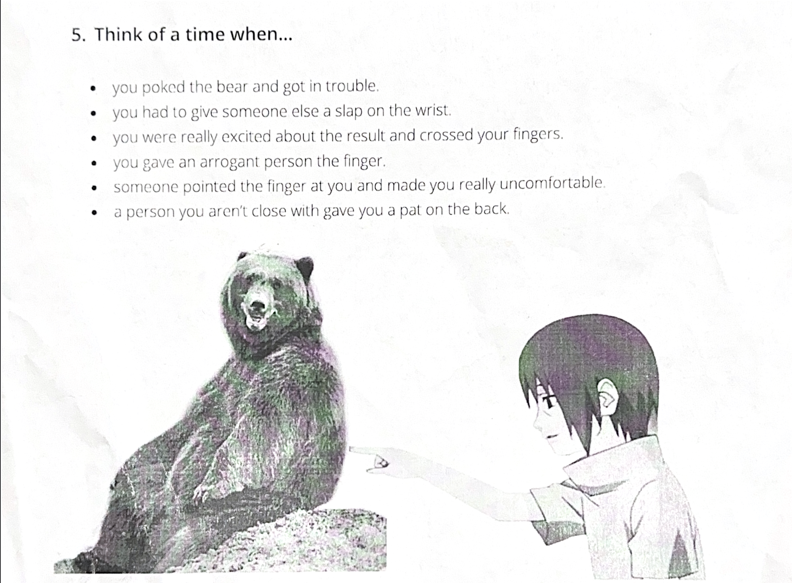

# Home tasks 🏠

- [Back to the README](../../README.md)

## Table of Contents

- October 2024:

    - [HW - 16.10.2024 (Maria)](#hw1)

    - [HW - 28.10.2024 (Maria)](#hw2)

- November 2024:

    - [HW - 11.11.2024 (Maria)](#hw3)

---

## HW - 16.10.2024

---

1) **So, yeah**. At the last lesson we were talking about quadrobics, but I can add the other one - gambling. This is catching fire phenomena where every person should be rich at some point. Do you know, that gambling is healthy for you, because we have statistic that shows us count of dying: 1 million dying from smoking every year, 3 more million dying from alcohol abuse, but no one, no one have ever died from gambling. This is because gambling is healthy for you and this is a fundamental thing people need to live.

---

2) **Well, there** is only one option - GAMBLING! But we are so serious people and I have to answer you the same way. So, got to admit that I am not a both nervous and furious person and I've never been at the situation like in the answer, because I have a stable mind, but if we are going to imagine this situation, I would like to meet with my closest friends, discuss it with them, and after this crisis we will develop a company "Meme dogs" and we will dive in with both feet!

---

3) **No**, I'm not going to be part of any subculture, because I believe in Russia, in the Motherland, and no organization will sag me off.

---

4) **I guess** it would be helpful for me to brush up on both articles and mixed conditionals (actually, I don't know the real name of this theme);

---

5) Strange question, but we're here to practice our English, and I'm going to present the situation again. Yes, 7 years ago I had a friend Joe who was such an angry and anxious person. I didn't know what his problem was, but it was an outstanding trait of his mind and my gut feeling told me that I needed to stop communicating with him, and then I heard the following: A little boy from Grove Street killed everyone around him (mother, father, brother, etc.), even himself.... So where is the alarm sounding? I spoke to parents and teachers beforehand, but no one believed me, and it's so sad....

---

## HW - 28.10.2024

1) **I can remember** only my first time at dormitory. I like to bother and irritate people from time to time because I find it so funny. However, at some point, I got into troubles because I sicked someone and after that I had to apologize and bring a several cheapy gifts.

2) **Last time** I had to give a slap on the wrist when I had received a group project at the end of deadline. It hardly worked and looked like a huddle of weirdos had done it. I slapped them all and finished it on time. In the end we got a good mark, but I promise that I won't trust them at all.

3) **So, these** were my exams that eventually helped me to enter the university. I remember being afraid of bad results because my parents said me that I would have to pay for my education by myself, regardless of whether it was the government support or my own funds. And in the end, I managed and I'am studying at HSE.

4) **I can't say** it was an arrogant person, but it was strange passerby. He wasn't sober and he had a terrible smell. While as I was getting off the bus, he gave me a couple of insults because I had looked at him. I gave him a finger and this is the end of this rather exciting story. 

5) **I think** this story is so usual for all of us, because it's a typical for our lifestyle. Of course, I remember these moments, although there were a lot. I can't bear if anyone complaint about the other person without any reasons and it's so hard to stay calm. I remember school days, even elementary school. For example, someone had spilled a water on the floor and my classmate pointed the finger at me, though I wasn't.

6) **Oh**, there have been plenty of situations where strangers have patted me on the back because I can easily get along with people and take a fluent and calm conversations. The last time this happened was at the beginning of my second year at university. I was hanging around the smoking area, talking with my mates about… No, I won’t share that piece of nonsense. After a while, someone asked us about university matters, and we had a small talk about business. Then he patted me on the back and gave me a phone number because I supported him and came up with useful ideas.

---

## HW - 11.11.2024

1) 
    > ### @Bella_Poulter
    > I'm drowning in a sea of spreadsheets, deadlines, and conference calls. My brain feels like it's been  
    > replaced with a bag of mashed potatoes. I know I need to take a break, but my boss is a total  
    > workaholic and everyone else is buzzing with energy. I feel like a deflated party balloon compared to  
    > them! How do I get some downtime without looking like a slacker?  

    [Student]()

### @TrumpTower
Hello, Bella! I see your problem and I'd like to give you a piece of advice.  
Don't panic! Calm down and discard your sad thoughts for the sake of good interpretation of   
my instructions. Rejoice, this is usual pattern of many people all over the world, and psychologists  
have already found the solution:  
- Asses your needs:  
understanding your level of tiredness and the features of burnout is very important.  
    It will help you to prove your necessity of relaxation both for yourself and for colleagues.  
 
- Work-life balance:  
    If it's possible to find this balance, you should spend your free time not just to have a rest,  
    but for self-development. It could be learning of something mysterious, pleasant, applying, brand new,  
    e.g. course of Spanish or French, calculus (why not 😁), algorithms and so on. Also It would be    
    beneficial to combine these activities with your main job.  

- Vacation:  
    Of course, you have to take a rest in the direct meaning. Go abroad, opt for a warm country, sit on a plane,  
    close your eyes and imagine yellowish sunlight sand, meanwhile, as the plane takes off and at this point of time  
    try to forget about your problems, pets, relatives and, though it may seem obvious, you should leave the work  
    thoughts behind you. And after your weekends, when you get back to the work, try to show results. You  
    should demonstrate that vacation gave you a burst of energy and all was not in vain.  

So, I hope and wish these advices will help you to manage with your burn-out and I will be waiting for your message eagerly.

2) 
    > ### @Max_Well
    > My social calendar of bursting with events - weddings, birthdays, book launches... you name it. I love  
    > my friends, but I feel like I'm on a constant hamster wheel of cocktails and small talk. I'm starting to  
    > sound like a broken record, repeating the same stories about my cat and my sourdough starter. I  
    > need a break, but saying "no" feels like a betrayal to everyone! How do I escape this social vortex?  

    [Student]()

### @RickOwens_213_EastA
Good evening, Max! Awareness of your overloaded social obligations is  
the first step in the search for a solution. Here are several tips that  
can help you to break free this social vortex:  
1) Balance between "yes" and "no":  
    Use the tactic of reasonable refusal. You can suggest an alternative way, instead  
    of saying "no" for all invitations. For instance, if you can't attend a birthday,  
    then you should come up with a spontaneous meeting at a cafe in another day, when  
    you have more time.  
2) Discussion with friends:  
    Don't be afraid to talk to your own friends about your feelings. Perhaps, they feel  
    the same and they are free to make a conversation that could lead you all to the  
    best solution of problem.  
3) Practice of mindfulness:  
    Understanding of meditation or practice of mindfulness should help you to decrease level  
    of anxiety from daily hustle. It gives you a possibility to realize your requirements  
    and accept your decisions in the best way.  
4) Check of your "social fund":  
    Imagine that you have certain amount of "social credits" for month. Decide how much of  
    them you are ready to spend for the event. This will solve misunderstanding when and 
    where it's better to hand out.  

And remember, It's so important to take care of your own boundaries. This doesn't mean that you betray everyone. You have the right to relaxation. Enjoy downtime!