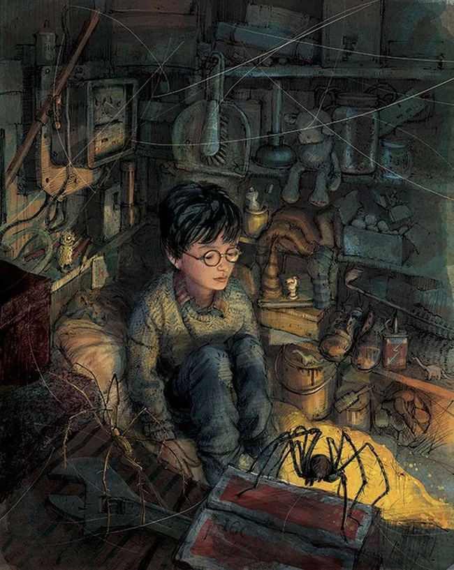
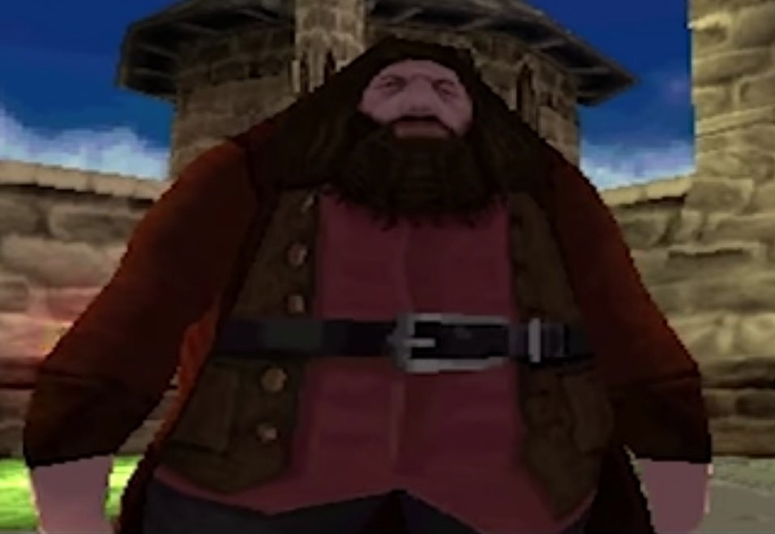
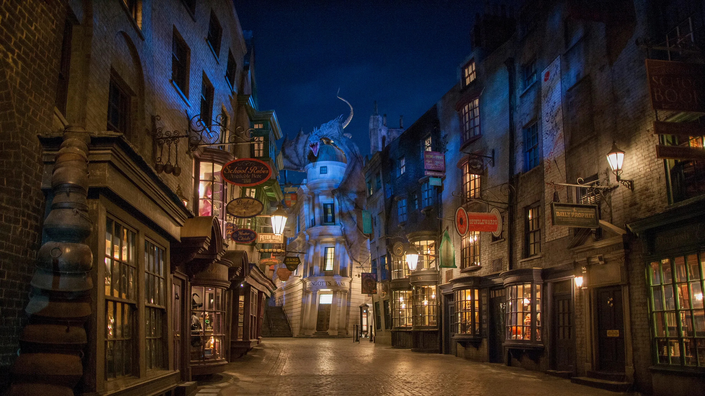

# Harry Potter and the Sorcerer's Stone

- [Back to the README](../../README.md)

##  English vocabulary and the other stuff.

## Table of Contents

- [Chapter 1](#chapter-1)

- [Chapter 2](#chapter-2)

- [Chapter 3](#chapter-3)

- [Chapter 4](#chapter-4)

---

### ⚡🤓🪄🦌 First chapter

- **be involved** - **быть вовлеченным** (в) - They were the last people you'd expect to `be involved` in anything strange or mysterious, ...

- **nonsense** - **ерунда** [🔗](https://dictionary.cambridge.org/ru/словарь/английский/nonsense) - because they just didn't hold with such `nonsense`.

- **beefy** - **having a large and muscular body** [🔗](https://context.reverso.net/перевод/английский-русский/beefy) - He was a big, `beefy` man ...

- **with hardly any neck** - Он был большим, мускулистым (мясистым) мужчиной `почти без шеи` (то ли заплыла жиром, то ли еще что-то);

- **craning over garden fences** - вытягивать шею над садовыми заборами (craning [🔗](https://context.reverso.net/перевод/английский-русский/craning));

- **spy**:

    - `verb` - **шпионить, следить**;

    - `noun` - **шпион**, **шпионаж**, [🔗](https://context.reverso.net/перевод/английский-русский/spy);

- **finer** - compartive form of **fine**!;

- **to bear** - **вынести**, **перенести**, **терпеть**, [🔗](https://context.reverso.net/перевод/английский-русский/to+bear);

- **good-for-nothing** - a person who is lazy and not helpful or useful, [🔗](https://dictionary.cambridge.org/ru/%D1%81%D0%BB%D0%BE%D0%B2%D0%B0%D1%80%D1%8C/%D0%B0%D0%BD%D0%B3%D0%BB%D0%B8%D0%B9%D1%81%D0%BA%D0%B8%D0%B9/good-for-nothing);

- **to shudder** - дрожать, пугаться  [🔗](https://dictionary.cambridge.org/ru/словарь/англо-русский/shudder);

- **to suggest** - useful link [🔗](https://dictionary.cambridge.org/ru/словарь/англо-русский/suggest);

- **to hum** - напевать (про себя), гудеть, шуметь  [🔗](https://dictionary.cambridge.org/ru/%D1%81%D0%BB%D0%BE%D0%B2%D0%B0%D1%80%D1%8C/%D0%B0%D0%BD%D0%B3%D0%BB%D0%B8%D0%B9%D1%81%D0%BA%D0%B8%D0%B9/hum);

- **gossip away** - сплетничать [🔗](https://context.reverso.net/%D0%BF%D0%B5%D1%80%D0%B5%D0%B2%D0%BE%D0%B4/%D0%B0%D0%BD%D0%B3%D0%BB%D0%B8%D0%B9%D1%81%D0%BA%D0%B8%D0%B9-%D1%80%D1%83%D1%81%D1%81%D0%BA%D0%B8%D0%B9/gossip+away);

- **wrestle** - бороться [🔗](https://dictionary.cambridge.org/ru/%D1%81%D0%BB%D0%BE%D0%B2%D0%B0%D1%80%D1%8C/%D0%B0%D0%BD%D0%B3%D0%BB%D0%BE-%D1%80%D1%83%D1%81%D1%81%D0%BA%D0%B8%D0%B9/wrestle);

- **tawny owl** - Серая неясыть (сова);

- **to flutter** - пролететь [🔗](https://dictionary.cambridge.org/dictionary/english/flutter);

- **briefcase** - портфель [🔗](https://dictionary.cambridge.org/ru/%D1%81%D0%BB%D0%BE%D0%B2%D0%B0%D1%80%D1%8C/%D0%B0%D0%BD%D0%B3%D0%BB%D0%BE-%D1%80%D1%83%D1%81%D1%81%D0%BA%D0%B8%D0%B9/briefcase);

- **peck** - клюнуть, чмокнуть [🔗](https://dictionary.cambridge.org/ru/%D1%81%D0%BB%D0%BE%D0%B2%D0%B0%D1%80%D1%8C/%D0%B0%D0%BD%D0%B3%D0%BB%D0%BE-%D1%80%D1%83%D1%81%D1%81%D0%BA%D0%B8%D0%B9/peck);

- **tyke** - a child who behaves badly in a way that is funny rather than serious [🔗](https://dictionary.cambridge.org/ru/%D1%81%D0%BB%D0%BE%D0%B2%D0%B0%D1%80%D1%8C/%D0%B0%D0%BD%D0%B3%D0%BB%D0%B8%D0%B9%D1%81%D0%BA%D0%B8%D0%B9/tyke);

- **chortle** - to laugh, showing pleasure and satisfaction [🔗](https://dictionary.cambridge.org/ru/%D1%81%D0%BB%D0%BE%D0%B2%D0%B0%D1%80%D1%8C/%D0%B0%D0%BD%D0%B3%D0%BB%D0%B8%D0%B9%D1%81%D0%BA%D0%B8%D0%B9/chortle);

- **back out** - отступить, отъехать, отпустить [🔗](https://context.reverso.net/%D0%BF%D0%B5%D1%80%D0%B5%D0%B2%D0%BE%D0%B4/%D0%B0%D0%BD%D0%B3%D0%BB%D0%B8%D0%B9%D1%81%D0%BA%D0%B8%D0%B9-%D1%80%D1%83%D1%81%D1%81%D0%BA%D0%B8%D0%B9/back+out);

- **peculiar** - странное, особое, необычное [🔗](https://context.reverso.net/%D0%BF%D0%B5%D1%80%D0%B5%D0%B2%D0%BE%D0%B4/%D0%B0%D0%BD%D0%B3%D0%BB%D0%B8%D0%B9%D1%81%D0%BA%D0%B8%D0%B9-%D1%80%D1%83%D1%81%D1%81%D0%BA%D0%B8%D0%B9/peculiar);

- **jerk around** - повернул что-то (jerked his head around);

- **tabby** - striped or brindled coat pattern of a cat (полосатый) [🔗](https://context.reverso.net/%D0%BF%D0%B5%D1%80%D0%B5%D0%B2%D0%BE%D0%B4/%D0%B0%D0%BD%D0%B3%D0%BB%D0%B8%D0%B9%D1%81%D0%BA%D0%B8%D0%B9-%D1%80%D1%83%D1%81%D1%81%D0%BA%D0%B8%D0%B9/tabby);

- **to blink** - моргать [🔗](https://dictionary.cambridge.org/ru/%D1%81%D0%BB%D0%BE%D0%B2%D0%B0%D1%80%D1%8C/%D0%B0%D0%BD%D0%B3%D0%BB%D0%BE-%D1%80%D1%83%D1%81%D1%81%D0%BA%D0%B8%D0%B9/blink);

- **cloak** - плащ;

- **getups** - style of arrangement of clothing [🔗](https://context.reverso.net/%D0%BF%D0%B5%D1%80%D0%B5%D0%B2%D0%BE%D0%B4/%D0%B0%D0%BD%D0%B3%D0%BB%D0%B8%D0%B9%D1%81%D0%BA%D0%B8%D0%B9-%D1%80%D1%83%D1%81%D1%81%D0%BA%D0%B8%D0%B9/getups);

- **steering wheel** - руль;

- **weirdo** - чудак;

- **huddle** - куча, толпа;

- **enraged** - в ярости, разгневанный [🔗](https://context.reverso.net/%D0%BF%D0%B5%D1%80%D0%B5%D0%B2%D0%BE%D0%B4/%D0%B0%D0%BD%D0%B3%D0%BB%D0%B8%D0%B9%D1%81%D0%BA%D0%B8%D0%B9-%D1%80%D1%83%D1%81%D1%81%D0%BA%D0%B8%D0%B9/enraged);

- **stunt** - трюк [🔗](https://dictionary.cambridge.org/ru/%D1%81%D0%BB%D0%BE%D0%B2%D0%B0%D1%80%D1%8C/%D0%B0%D0%BD%D0%B3%D0%BB%D0%BE-%D1%80%D1%83%D1%81%D1%81%D0%BA%D0%B8%D0%B9/stunt);

- **swooping** - падающий, пикирующий [🔗](https://dictionary.cambridge.org/ru/%D1%81%D0%BB%D0%BE%D0%B2%D0%B0%D1%80%D1%8C/%D0%B0%D0%BD%D0%B3%D0%BB%D0%BE-%D1%80%D1%83%D1%81%D1%81%D0%BA%D0%B8%D0%B9/swoop?q=swooping);

- **bun** - булочка, пучок;

- **to yell** - кричать, орать;

- **broad daylight** - средь бела дня;

- **gaze** - смотреть, не отрываясь [🔗](https://dictionary.cambridge.org/ru/%D1%81%D0%BB%D0%BE%D0%B2%D0%B0%D1%80%D1%8C/%D0%B0%D0%BD%D0%B3%D0%BB%D0%BE-%D1%80%D1%83%D1%81%D1%81%D0%BA%D0%B8%D0%B9/swoop?q=swooping);

- **uneasy** - беспокойство;

- **bunch** - толпа, куча;

- **dash back** - вернуться;

- **to seize** - воспользоваться, захватить, перехватить, схватить [🔗](https://context.reverso.net/%D0%BF%D0%B5%D1%80%D0%B5%D0%B2%D0%BE%D0%B4/%D0%B0%D0%BD%D0%B3%D0%BB%D0%B8%D0%B9%D1%81%D0%BA%D0%B8%D0%B9-%D1%80%D1%83%D1%81%D1%81%D0%BA%D0%B8%D0%B9/seize) and [🔗](https://dictionary.cambridge.org/ru/%D1%81%D0%BB%D0%BE%D0%B2%D0%B0%D1%80%D1%8C/%D0%B0%D0%BD%D0%B3%D0%BB%D0%B8%D0%B9%D1%81%D0%BA%D0%B8%D0%B9/seize?q=seize+);

- **to dial** - набирать номер телефона;

- **to grunt** - ворчнуть, хрюкнуть [🔗](https://dictionary.cambridge.org/ru/словарь/англо-русский/grunt);

- **to stumble** - спотыкаться, споткнуться, [🔗](https://dictionary.cambridge.org/ru/словарь/англо-русский/stumble?q=stumble+);

- **on the contrary** - наоборот  [🔗](https://dictionary.cambridge.org/ru/словарь/англо-русский/contrary);

- **squeaky** - скрипучий, писклявый [🔗](https://dictionary.cambridge.org/ru/словарь/англо-русский/squeaky);

- **passerby** - someone who is going past a particular place;

- **rejoice** - радоваться, ликовать [🔗](https://context.reverso.net/перевод/английский-русский/rejoice);

- **You-Know-Who** - в фильме это звучало так: "Сам знаешь кто";

- **rooted** - very strong and firmly fixed [🔗](https://dictionary.cambridge.org/ru/словарь/английский/rooted);

- **spot** - место;

- **rooted to the spot** - прикованный к месту;

- **rattled** - напуганный;

- **stern** - суровый (a stern look);

- **newscaster** - диктор, ведущий новостей [🔗](https://context.reverso.net/перевод/английский-русский/newscaster);

- **grin** - улыбка, усмешка [🔗](https://context.reverso.net/перевод/английский-русский/grin);

- **oddly** - странно, странным образом, необычно [🔗](https://context.reverso.net/перевод/английский-русский/oddly);

- **to clutch** - взяться за что-то (крепко) [🔗](https://dictionary.cambridge.org/ru/словарь/английский/clutch);

- **throat** - горло;

- **sharply** - резко (she said sharply);

- **to mumble** - бормоать [🔗](https://context.reverso.net/перевод/английский-русский/to+mumble);

- **pursed lips** - поджатые губы;

- **to dare** - осмелиться [🔗](https://dictionary.cambridge.org/ru/словарь/английский/dare);

- **stiffly** - жестко, напряженно [🔗](https://context.reverso.net/перевод/английский-русский/stiffly);

- **to creep** - подкрасться, тащиться [🔗](https://dictionary.cambridge.org/ru/словарь/англо-русский/creep?q=creep+). (creep - crept - crept);

- **peer** - вглядыватся, смотреть, сверстник, коллега [🔗](https://context.reverso.net/перевод/английский-русский/peer);

- **lay awake** - лежал без сна, лежал в кровати [🔗](https://context.reverso.net/перевод/английский-русский/lay+awake);

- **yawn** - зевнуть [🔗](https://context.reverso.net/перевод/английский-русский/yawn);

- **to quiver** - дрожать, трепетать [🔗](https://context.reverso.net/перевод/английский-русский/quiver);

- **to tuck into** - приступать к (еде) [🔗](https://dictionary.cambridge.org/dictionary/english-russian/tuck-in-tuck-into-sth);

- **spectacles** - glasses;

- **crooked** - not straight, not honest;

- **to rummage** - to search for something that is difficult to find among other things [🔗](https://dictionary.cambridge.org/ru/%D1%81%D0%BB%D0%BE%D0%B2%D0%B0%D1%80%D1%8C/%D0%B0%D0%BD%D0%B3%D0%BB%D0%B8%D0%B9%D1%81%D0%BA%D0%B8%D0%B9/rummage);

- **to chuckle** - усмехнуться [🔗](https://dictionary.cambridge.org/ru/словарь/английский/chuckle);

- **to mutter** - бормотать [🔗](https://dictionary.cambridge.org/ru/словарь/английский/mutter);

- **pavement** - a path with a hard surface on one or both sides of a road, that people walk on [🔗](https://dictionary.cambridge.org/ru/словарь/английский/pavement);

- **flock** - a group of sheep, goats, or birds [🔗](https://dictionary.cambridge.org/ru/словарь/английский/flock?q=flocks);

- **bound** -  certain or extremely likely to happen [🔗](https://dictionary.cambridge.org/ru/словарь/английский/bound);

- **irritably** - in a way that shows that you become annoyed very easily [🔗](https://dictionary.cambridge.org/ru/словарь/английский/irritably);

- **rumor** - an unofficial interesting story or piece of news that might be true or invented, and quickly spreads from person to person  [🔗](https://dictionary.cambridge.org/ru/словарь/английский/rumor);

- **flinch** - to make a sudden, small movement because of pain or fear;

- **exasperated** - extremely annoyed;

- **to flatter** - to praise someone in order to make them feel attractive or important, sometimes in a way that is not sincere;

- **earmuffs** - a pair of small pieces of material like fur worn over the ears with a strap that goes over the head to keep them on;

- **to bow** - to bend your head or body forward, especially as a way of showing someone respect or expressing thanks to people who have watched you perform;

- **to gasp** - to take a short, quick breath through the mouth, especially because of surprise, pain, or shock  [🔗](https://dictionary.cambridge.org/ru/словарь/английский/gasp);

- **to nod** - to move your head down and then up, sometimes several times, especially to show agreement, approval, or greeting, or to show something by doing this [🔗](https://dictionary.cambridge.org/ru/словарь/английский/nod);

- **glumly** - in a disappointed or unhappy way;

- **to falter** - to lose strength or purpose and stop, or almost stop;

- **a lace handkerchief** - кружевной платок;

- **grudgingly** - ununwillingly;

- **astride** - верхом;

- **get a grip on yourself** - взять себя в руки;

- **twinkling light** - мерцающий свет;

And that's the end of it! I congratulate myself! The first chapter is finished. Only 17 more to go...

---

### 🏰🧙‍♂️🪄🦁 Second chapter

- **tidy** - having everything in the right place and arranged in a good order [🔗](https://dictionary.cambridge.org/ru/%D1%81%D0%BB%D0%BE%D0%B2%D0%B0%D1%80%D1%8C/%D0%B0%D0%BD%D0%B3%D0%BB%D0%BE-%D1%80%D1%83%D1%81%D1%81%D0%BA%D0%B8%D0%B9/tidy);

- **brass** - латунь [🔗](https://dictionary.cambridge.org/ru/%D1%81%D0%BB%D0%BE%D0%B2%D0%B0%D1%80%D1%8C/%D0%B0%D0%BD%D0%B3%D0%BB%D0%BE-%D1%80%D1%83%D1%81%D1%81%D0%BA%D0%B8%D0%B9/brass);

- **lit up** - освещенный, освещать [🔗](https://context.reverso.net/%D0%BF%D0%B5%D1%80%D0%B5%D0%B2%D0%BE%D0%B4/%D0%B0%D0%BD%D0%B3%D0%BB%D0%B8%D0%B9%D1%81%D0%BA%D0%B8%D0%B9-%D1%80%D1%83%D1%81%D1%81%D0%BA%D0%B8%D0%B9/lit+up);

- **fateful** - роковой [🔗](https://dictionary.cambridge.org/dictionary/english-russian/fateful);

- **mantlepiece** - каминная полка [🔗](https://dictionary.cambridge.org/dictionary/english-russian/mantelpiece);

- **shrill** - having a loud and high sound that is unpleasant or painful to listen to [🔗](https://dictionary.cambridge.org/dictionary/english/shrill);

- **rap on** - наброситься;

- **screech** - to make an unpleasant, loud, high voice [🔗](https://dictionary.cambridge.org/dictionary/english/screech);

- **tp demand** - требовать [🔗](https://context.reverso.net/%D0%BF%D0%B5%D1%80%D0%B5%D0%B2%D0%BE%D0%B4/%D0%B0%D0%BD%D0%B3%D0%BB%D0%B8%D0%B9%D1%81%D0%BA%D0%B8%D0%B9-%D1%80%D1%83%D1%81%D1%81%D0%BA%D0%B8%D0%B9/demanded) and [🔗](https://dictionary.cambridge.org/dictionary/english/demand);

- **to groan** - a deep, long sound showing great pain or unhappiness;

- **comb**:

    - `noun`: a flat piece of plastic, wood, or metal with a thin row of long, narrow parts along one side, used to tidy and arrange your hair;

    - `verb`: to tidy your hair using a comb [🔗](https://dictionary.cambridge.org/dictionary/english/comb);

- **meanwhile** - тем временем [🔗](https://dictionary.cambridge.org/dictionary/english/meanwhile);

- **popkin** - ласковое обращение к ребенку;

- **slug** - a small, usually black or brown creature with a long, soft body and no arms or legs, like a snail but with no shell [🔗](https://dictionary.cambridge.org/dictionary/english/slug);

- **revolting** - отвращающий [🔗](https://dictionary.cambridge.org/dictionary/english/revolting);

- **chimney** - дымоход;

- **headmistress** - a woman who is in charge of a school [🔗](https://dictionary.cambridge.org/dictionary/english/headmistress);

- **hoodlum** - a violent person, especially one who is member of a group of criminals;

- **remarkably** - удивительно;

- **knickerbocker glory** - a sweet dish consisting of layers of ice cream, fruit, jelly, and cream, served in a tall glass  [🔗](https://dictionary.cambridge.org/dictionary/english/knickerbocker-glory?q=knickerbocker);

- **intently** - внимательно;

- **boredom** - the state of being bored [🔗](https://dictionary.cambridge.org/dictionary/english/boredom);

- **vigorously** - in a way that is very forceful and energetic [🔗](https://dictionary.cambridge.org/dictionary/english/vigorously);

---

## ⚯ϟ Third chapter

- **be allowed out** - выпустили (из), разрешено [🔗](https://context.reverso.net/%D0%BF%D0%B5%D1%80%D0%B5%D0%B2%D0%BE%D0%B4/%D0%B0%D0%BD%D0%B3%D0%BB%D0%B8%D0%B9%D1%81%D0%BA%D0%B8%D0%B9-%D1%80%D1%83%D1%81%D1%81%D0%BA%D0%B8%D0%B9/allowed+out) and [🔗](https://context.reverso.net/%D0%BF%D0%B5%D1%80%D0%B5%D0%B2%D0%BE%D0%B4/%D0%B0%D0%BD%D0%B3%D0%BB%D0%B8%D0%B9%D1%81%D0%BA%D0%B8%D0%B9-%D1%80%D1%83%D1%81%D1%81%D0%BA%D0%B8%D0%B9/be+allowed+out);

- **crutch** - a stick with a handle and a part that fits around your lower arm, or a stick with piece that fits under the arm, that you lean on for support if you have difficulty in walking because of a foot or leg injury [🔗](https://dictionary.cambridge.org/ru/%D1%81%D0%BB%D0%BE%D0%B2%D0%B0%D1%80%D1%8C/%D0%B0%D0%BD%D0%B3%D0%BB%D0%B8%D0%B9%D1%81%D0%BA%D0%B8%D0%B9/crutch?q=crutches);

- **ray** - a narrow beam of light, heat, etc. travelling in a straight line from its place of origin [🔗](https://dictionary.cambridge.org/ru/%D1%81%D0%BB%D0%BE%D0%B2%D0%B0%D1%80%D1%8C/%D0%B0%D0%BD%D0%B3%D0%BB%D0%B8%D0%B9%D1%81%D0%BA%D0%B8%D0%B9/ray);

- **maroon** - бордовый;

- **tailcoat** - an old-fashioned type of man's coat, waist-length at the front and with the lower half of the back divided into two pieces, now only worn on very formal occasions [🔗](https://dictionary.cambridge.org/ru/%D1%81%D0%BB%D0%BE%D0%B2%D0%B0%D1%80%D1%8C/%D0%B0%D0%BD%D0%B3%D0%BB%D0%B8%D0%B9%D1%81%D0%BA%D0%B8%D0%B9/tailcoat);

- **knickerbockers** - панталоны;

- **rib** - a bone that curves round from your back to your chest [🔗](https://dictionary.cambridge.org/ru/%D1%81%D0%BB%D0%BE%D0%B2%D0%B0%D1%80%D1%8C/%D0%B0%D0%BD%D0%B3%D0%BB%D0%B8%D0%B9%D1%81%D0%BA%D0%B8%D0%B9/rib);

- **doormat** - a piece of thick material that is put on the floor by a door, used to clean your shoes on when you go into a building [🔗](https://dictionary.cambridge.org/ru/%D1%81%D0%BB%D0%BE%D0%B2%D0%B0%D1%80%D1%8C/%D0%B0%D0%BD%D0%B3%D0%BB%D0%B8%D0%B9%D1%81%D0%BA%D0%B8%D0%B9/doormat);

- **envelop** - a flat, usually square or rectangular, paper container for a letter [🔗](https://dictionary.cambridge.org/ru/%D1%81%D0%BB%D0%BE%D0%B2%D0%B0%D1%80%D1%8C/%D0%B0%D0%BD%D0%B3%D0%BB%D0%B8%D0%B9%D1%81%D0%BA%D0%B8%D0%B9/envelope);

- **twang** - to make a noise like that of a tight string being quickly pulled and released [🔗](https://dictionary.cambridge.org/ru/%D1%81%D0%BB%D0%BE%D0%B2%D0%B0%D1%80%D1%8C/%D0%B0%D0%BD%D0%B3%D0%BB%D0%B8%D0%B9%D1%81%D0%BA%D0%B8%D0%B9/twang);

- **parchment** - пергамент;

- **badger** - барсук;

- **snort** - to make an explosive sound by forcing air quickly up or down the nose [🔗](https://dictionary.cambridge.org/ru/%D1%81%D0%BB%D0%BE%D0%B2%D0%B0%D1%80%D1%8C/%D0%B0%D0%BD%D0%B3%D0%BB%D0%B8%D0%B9%D1%81%D0%BA%D0%B8%D0%B9/snort);

- **faint** - to suddenly become unconscious for a short time, usually falling down [🔗](https://dictionary.cambridge.org/ru/%D1%81%D0%BB%D0%BE%D0%B2%D0%B0%D1%80%D1%8C/%D0%B0%D0%BD%D0%B3%D0%BB%D0%B8%D0%B9%D1%81%D0%BA%D0%B8%D0%B9/faint);

- **by the scruff of the/your neck** - I took/grabbed him by the scruff of his neck and threw him out of the hall;

- **keyhole** - замочная скважина;

- **promptly** - quickly, without delay, or at the arranged time;

- **tread - trod - trodden** - to put your foot on something or to press something down with your foot;

- **squashy** - soft and easy to crush [🔗](https://dictionary.cambridge.org/ru/%D1%81%D0%BB%D0%BE%D0%B2%D0%B0%D1%80%D1%8C/%D0%B0%D0%BD%D0%B3%D0%BB%D0%B8%D0%B9%D1%81%D0%BA%D0%B8%D0%B9/squashy);

- **through a mouthful of nails** - it is common practice to use one's mouth as an additional "hand" to hold small nontoxic objects [🔗](https://ell.stackexchange.com/questions/134248/what-does-through-a-mouthful-of-nails-mean-here);

- **pelt** - to throw a number of things quickly at someone or something [🔗](https://dictionary.cambridge.org/ru/%D1%81%D0%BB%D0%BE%D0%B2%D0%B0%D1%80%D1%8C/%D0%B0%D0%BD%D0%B3%D0%BB%D0%B8%D0%B9%D1%81%D0%BA%D0%B8%D0%B9/pelt);

- **outskirts** - the areas that form the edge of a town or city [🔗](https://dictionary.cambridge.org/ru/%D1%81%D0%BB%D0%BE%D0%B2%D0%B0%D1%80%D1%8C/%D0%B0%D0%BD%D0%B3%D0%BB%D0%B8%D0%B9%D1%81%D0%BA%D0%B8%D0%B9/outskirts);

- **stale** - no longer new or fresh, usually as a result of being kept for too long;

- **timidly** - in a shy or nervous way;

- **suspension** - подвесной;

- **snivel** - to cry slightly in a way that is weak and does not make other people feel sympathy for you;

- **amble** - to walk in a slow and relaxed way;

- **chilly** - cold [🔗](https://dictionary.cambridge.org/ru/%D1%81%D0%BB%D0%BE%D0%B2%D0%B0%D1%80%D1%8C/%D0%B0%D0%BD%D0%B3%D0%BB%D0%B8%D0%B9%D1%81%D0%BA%D0%B8%D0%B9/chilly);

- **damp** - slightly wet, especially in a way that is not pleasant or comfortable;

- **shrivel** - to become dry, smaller, and covered with lines as if by crushing or folding, or to make something do this [🔗](https://dictionary.cambridge.org/ru/%D1%81%D0%BB%D0%BE%D0%B2%D0%B0%D1%80%D1%8C/%D0%B0%D0%BD%D0%B3%D0%BB%D0%B8%D0%B9%D1%81%D0%BA%D0%B8%D0%B9/shrivel);

- **splatter** - забрызгивать, разбрызгиваться [🔗](https://dictionary.cambridge.org/ru/%D1%81%D0%BB%D0%BE%D0%B2%D0%B0%D1%80%D1%8C/%D0%B0%D0%BD%D0%B3%D0%BB%D0%BE-%D1%80%D1%83%D1%81%D1%81%D0%BA%D0%B8%D0%B9/splatter)

- **ferociously** - свирепо, яростно;

- **creak** - скрип;

---

## 🧔🛖🏍🍺 Fourth chapter

- **cannon** - a very large gun, in the past one that was on wheels;

- **skid into** - заноситься (в основном про vehicle, но видимо Uncle Vernon есть машина);

- **rifle** - винтовка;

- **hinge** - a piece of metal that fastens the edge of a door, window, lid, etc. to something else and allows it to open or close [🔗](https://dictionary.cambridge.org/ru/%D1%81%D0%BB%D0%BE%D0%B2%D0%B0%D1%80%D1%8C/%D0%B0%D0%BD%D0%B3%D0%BB%D0%B8%D0%B9%D1%81%D0%BA%D0%B8%D0%B9/hinge?q=hinges);

- **beetle** - an insect with a hard shell-like back [🔗](https://dictionary.cambridge.org/ru/%D1%81%D0%BB%D0%BE%D0%B2%D0%B0%D1%80%D1%8C/%D0%B0%D0%BD%D0%B3%D0%BB%D0%B8%D0%B9%D1%81%D0%BA%D0%B8%D0%B9/beetle);

- **frame** - a border that surrounds and supports a picture, door, or window;

- **enormous** - extremely large;

- **grate** - a metal structure that holds coal or wood in a fireplace [🔗](https://dictionary.cambridge.org/ru/%D1%81%D0%BB%D0%BE%D0%B2%D0%B0%D1%80%D1%8C/%D0%B0%D0%BD%D0%B3%D0%BB%D0%B8%D0%B9%D1%81%D0%BA%D0%B8%D0%B9/grate);

- **bend** - to move your body or part of your body so that it is not straight:

- **copper** - медь;

- **amber** - янтарь, янтарный;

- **liquid** - a substance, such as water, that is not solid or a gas and that can be poured easily;

- **sizzling** - very hot;

- **gulp** - глоток;

- **cower** - to lower your head or body in fear, often while moving backwards [🔗](https://dictionary.cambridge.org/ru/%D1%81%D0%BB%D0%BE%D0%B2%D0%B0%D1%80%D1%8C/%D0%B0%D0%BD%D0%B3%D0%BB%D0%B8%D0%B9%D1%81%D0%BA%D0%B8%D0%B9/cower);

- **explode** - to break up into pieces violently, or to cause something to do this [🔗](https://dictionary.cambridge.org/ru/%D1%81%D0%BB%D0%BE%D0%B2%D0%B0%D1%80%D1%8C/%D0%B0%D0%BD%D0%B3%D0%BB%D0%B8%D0%B9%D1%81%D0%BA%D0%B8%D0%B9/explode);

- **bewildered** - confused and uncertain;

- **syllable** - a single unit of speech, either a whole word or one of the parts into which a word can be separated, usually containing a vowel;

- **witchcraft** - the activity of performing magic to help or harm other people;

- **wizardry** - the skill of a wizard;

- **deputy** - a person who is given the power to do something instead of another person, or the person whose rank is immediately below that of the leader of an organization [🔗](https://dictionary.cambridge.org/ru/%D1%81%D0%BB%D0%BE%D0%B2%D0%B0%D1%80%D1%8C/%D0%B0%D0%BD%D0%B3%D0%BB%D0%B8%D0%B9%D1%81%D0%BA%D0%B8%D0%B9/deputy);

- **quil** - a pen made from a bird's feather, used in the past;

- **dratted** - used for showing that you are angry or unhappy about something or with someone (проклятый, дрянной);

- **outrage** - возмущение;

- **gargoyles** - гаргульи;

- **foghorn** - туманный горн;

- **courage** - the ability to control your fear in a dangerous or difficult situation;

- **reckon** - to think or believe;

- **revenge** - месть;

- **beam**:

    - `verb`: to smile with obvious pleasure;

    - `noun`: a line of light that shines from a bright object;

- **ruefully** - in a way that shows that you are feeling sorry and wishing that something had not happened;

- **expel** - to force someone to leave a school, organization, or country;

- **dormouse** - грызун [wiki](https://en.wikipedia.org/wiki/Dormouse);

---

## 🏙️✨🧙‍♂️🛒 Fifth chapter

- **to shut** - to (cause to) close something:
    - Please `shut` the gate. [🔗](https://dictionary.cambridge.org/dictionary/english/shut);

- **tightly** - firmly or closely:

   - I've got a surprise for you! Shut your eyes `tightly` and hold out your hand [🔗](https://dictionary.cambridge.org/dictionary/english/tightly);

- **collapsed** - рухнувший;

- **claw** - коготь, клешня [🔗](https://dictionary.cambridge.org/dictionary/english/claw);

- **beak** - the hard, pointed part of a bird's mouth;

- **to scramble** - to move or climb quickly but with difficulty, often using your hands to help you [🔗](https://dictionary.cambridge.org/dictionary/english/scramble);

- **to swell** - to become larger and rounder than usual; to (cause to) increase in size or amount;

- **to wave** - to raise your hand and move it from side to side as a way of greeting someone, telling someone to do something, or adding emphasis to an expression;

- **to snap**:
    
    1) to cause something that is thin to break suddenly and quickly with a cracking sound:

       -  You'll `snap` that ruler if you bend it too far.
    
    2) to suddenly become unable to control a strong feeling, especially anger:

        - When she asked me to postpone my trip to help her move to her new house, I just `snapped` (= got angry).

- **fiercely** - in a frightening, violent, or powerful way;

- **to savage** - If an animal savages someone, it attacks them violently and causes serious injuries [🔗](https://dictionary.cambridge.org/dictionary/english/savage);

- **pellet** - the solid waste of particular animals [🔗](https://dictionary.cambridge.org/dictionary/english/pellet);

- **peppermit** - a strong fresh flavouring from a type of mint plant, used especially to give flavour to sweets [🔗](https://dictionary.cambridge.org/dictionary/english/peppermint);

- **handful** - горстка;

- **pouch** - a bag or soft container for a small object or a small amount of something [🔗](https://dictionary.cambridge.org/dictionary/english/pouch);

- **puncture**:
    
    - **verb** - to suddenly make someone less confident or positive **OR** to make a small hole in something, or to get a small hole in something;

    - **noun** - a small hole made by a sharp object, especially in a tyre;

- **to gleam** - to produce or reflect a small, bright light;

- **enchantment** - something that is thought to have magical power over someone (я думаю, что это чары);

- **summat** - something;

- **blimey** - черт побери, блин;

- **clamber** - o climb up, across, or into somewhere with difficulty, using the hands and the feet;

- **stitch** - a piece of thread sewn in cloth, or the single movement of a needle and thread into and out of the cloth that produces this [🔗](https://dictionary.cambridge.org/dictionary/english/stitch?q=stitches);

- **plain** - not decorated in any way; with nothing added;

- **fungus** (plural fungi) - any of various types of organisms that get their food from decaying material or other living things;

- **pewter** - смесь олова и свинца;

- **cauldron** - a large, round container for cooking in, usually supported over a fire, and used especially in the past;

- **broomstick** - метла;

- **bustling** - If a place is bustling, it is full of busy activity;

- **to halt** - to (cause to) stop moving or doing something or happening;

- **to steer** - to take someone or something or make someone or something go in the direction in which you want him, her, or it [🔗](https://dictionary.cambridge.org/dictionary/english/steer);

- **shabby** - looking old and in bad condition because of being used for a long time or not being cared for;

- **bartender** - бармен;

- **buzz** - шум [🔗](https://dictionary.cambridge.org/dictionary/english/buzz);

- **delighted** - very pleased;

- **to babble** - to talk or say something in a quick, confused, excited, or silly way;

- **courtyard** - an area of flat ground outside that is partly or completely surrounded by the walls of a building;

- **bloke** - a man, often one who is considered to be ordinary;

- **to wriggle** - o move somewhere using short, quick twisting movements [🔗](https://dictionary.cambridge.org/dictionary/english/wriggle);

- **archway** - арка;

- **instantly** - immediately;

- **plump** - пухлый(ая);

- **burnished** - smooth and shiny, usually because of being polished (= rubbed);

- **swarthy** - (of a person or their skin) dark;

- **to engrave** - to cut words, pictures, or patterns into the surface of metal, stone, etc.:;

- **greed** - a very strong wish to continuously get more of something, especially food or money;

- **torch** - факел;

- **maze** - лабиринт;

- **mound** - a large pile of earth, stones, etc. like a small hill;

- **ravine** - a deep narrow valley with steep sides;

- **mauve** - лиловый;

- **to smuggle** - to take things or people to or from a place secretly and often illegally;

- **toad** - жаба;

- **elbow** - локоть;

- **armpit** - подмышка;

